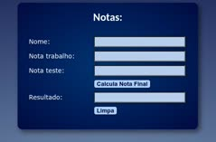

# Notas

 
 

> Notas

This project is a student grade calculator implemented using HTML, CSS, and JavaScript. It provides a simple and intuitive user interface for entering student information and calculating the final grade based on their assignment and test scores.

## Features

Grade Calculator provides the following features:
* input student information
* calculates the final grade based on the student's assignment and test scores

## Contributing

"If you'd like to contribute, please fork the repository and use a feature
branch. Pull requests are warmly welcome."

## Links

- Project homepage: https://github.com/phcrepaldi/notas
- Issue tracker:
  - In case of sensitive bugs like security vulnerabilities, please contact
    phcrepaldi@gmail.com directly instead of using issue tracker. We value your effort to improve the security and privacy of this project!

## Licensing

"The code in this project is licensed under MIT license."